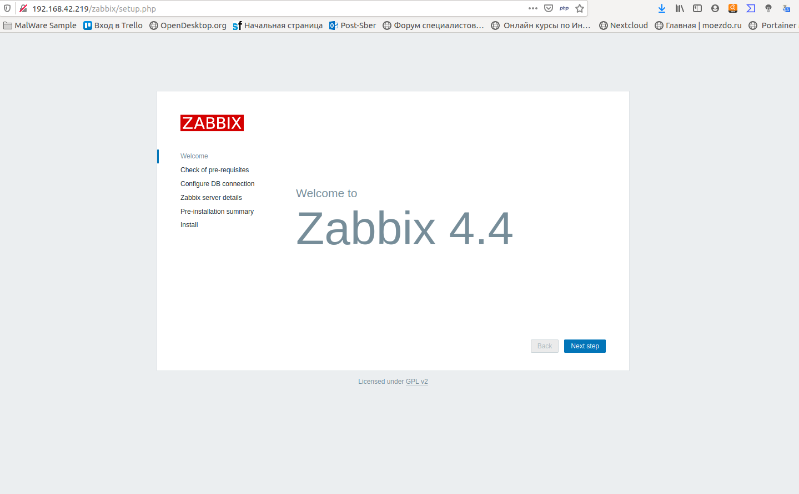
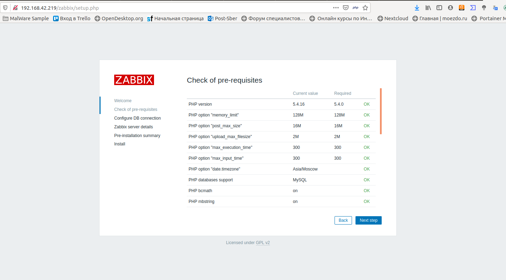
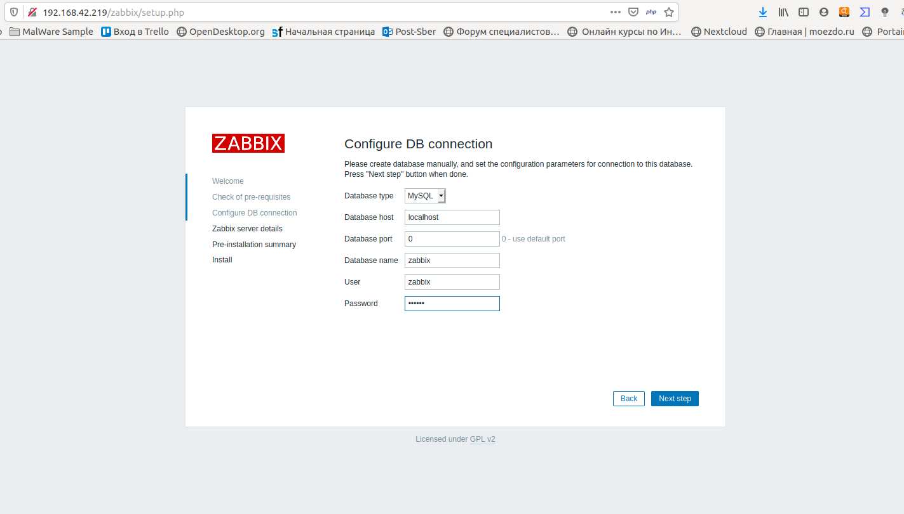
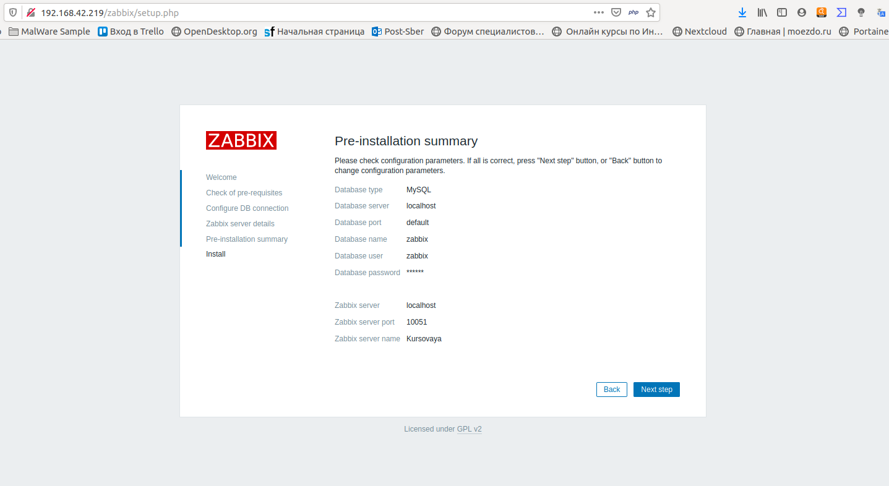
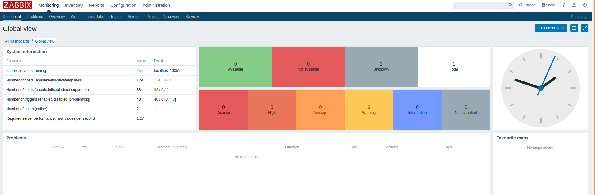

1) Для примера берем OS CentOS 7, настроиваем на VirtualBox общую сеть и подключаемся по ssh к нашей созданной виртуалке

```fish
┬─[mickwild@ISeeYou:~]─[17:15:48]
╰─>$ ssh root@192.168.42.99
```

2) Скачиваем с Kernel.org постеледнюю ванильную версию [ядра](https://cdn.kernel.org/pub/linux/kernel/v5.x/linux-5.4.3.tar.xz)

```bash
root@localhost ~# wget https://cdn.kernel.org/pub/linux/kernel/v5.x/linux-5.4.3.tar.xz
--2019-12-16 17:17:50--  https://cdn.kernel.org/pub/linux/kernel/v5.x/linux-5.4.3.tar.xz
Resolving cdn.kernel.org (cdn.kernel.org)... 151.101.113.176, 2a04:4e42:1b::432
Connecting to cdn.kernel.org (cdn.kernel.org)|151.101.113.176|:443... connected.
HTTP request sent, awaiting response... 200 OK
Length: 109443116 (104M) [application/x-xz]
Saving to: ‘linux-5.4.3.tar.xz’

100%[===================================================>] 109 443 116 1,35MB/s   in 66s    

2019-12-16 17:18:56 (1,59 MB/s) - ‘linux-5.4.3.tar.xz’ saved [109443116/109443116]
```
3) Разархивируем только что скачанный архив 
```bash
root@localhost ~# tar -xvf linux-5.4.3.tar.xz 
```
4) Переходим в директорию разархивированного ядра, копируем туда конфигурацию старого ядра, для того чтобы на основе него скомпилировать новое ядро
```bash
root@localhost ~/linux-5.4.3# cd ./linux-5.4.3 && cp /boot/config-3.10.0-1062.9.1.el7.x86_64 .config
```
5) Для компиляции ядра, нам потребуется скачать и установить 2 пакета make и gcc
6) После установки пакетов, начинаем создавать новый конфиг ядра, на основании старого
```bash
root@localhost ~/linux-5.4.3# make oldconfig
```
  6.1) Во время создания конфигурации потребуется установить пакеты которые запросит компилятор, пример:
```bash
root@localhost ~/linux-5.4.3# make oldconfig
  HOSTCC  scripts/basic/fixdep
  HOSTCC  scripts/kconfig/conf.o
  HOSTCC  scripts/kconfig/confdata.o
  HOSTCC  scripts/kconfig/expr.o
  LEX     scripts/kconfig/lexer.lex.c
/bin/sh: flex: command not found
make[2]: *** [scripts/kconfig/lexer.lex.c] Error 127
make[1]: *** [oldconfig] Error 2
make: *** [sub-make] Error 2
```
   6.2) Как мы можем видеть конфигуратор make не находит пакета flex 

```bash
/bin/sh: flex: command not found
```
   Соответствеено нам нужно скачать и установить его 
   
7) После того, как когфигурация соберется, терминал поприветствует вас окном с просьбой выбрать параметры конфигурации
```bash
root@localhost ~/linux-5.4.3# make oldconfig
  YACC    scripts/kconfig/parser.tab.[ch]
  HOSTCC  scripts/kconfig/lexer.lex.o
  HOSTCC  scripts/kconfig/parser.tab.o
  HOSTCC  scripts/kconfig/preprocess.o
  HOSTCC  scripts/kconfig/symbol.o
  HOSTLD  scripts/kconfig/conf
scripts/kconfig/conf  --oldconfig Kconfig
.config:695:warning: symbol value 'm' invalid for CPU_FREQ_STAT
.config:939:warning: symbol value 'm' invalid for NF_CT_PROTO_GRE
.config:967:warning: symbol value 'm' invalid for NF_NAT_REDIRECT
.config:970:warning: symbol value 'm' invalid for NF_TABLES_INET
.config:1137:warning: symbol value 'm' invalid for NF_TABLES_IPV4
.config:1141:warning: symbol value 'm' invalid for NF_TABLES_ARP
.config:1182:warning: symbol value 'm' invalid for NF_TABLES_IPV6
.config:1559:warning: symbol value 'm' invalid for NET_DEVLINK
.config:3661:warning: symbol value 'm' invalid for LIRC
*
* Restart config...
*
*
* General setup
*
Compile also drivers which will not load (COMPILE_TEST) [N/y/?] (NEW)
```
  7.1) Оставляем все как есть, если кто то хочет изменить конфигурацию, надо читать [документы](https://www.kernel.org/doc/) чтобы понимать что вы включаете или выключаете
8) После успешного создания конфига, начинаем сборку ядра в 4 потока 
```bash
root@localhost ~/linux-5.4.3# time make -j4
Dec 16 16:48:44 Installed: mpfr-3.1.1-4.el7.x86_64
Dec 16 16:48:44 Installed: libmpc-1.0.1-3.el7.x86_64
Dec 16 16:48:44 Installed: cpp-4.8.5-39.el7.x86_64
Dec 16 16:48:45 Installed: kernel-headers-3.10.0-1062.9.1.el7.x86_64
Dec 16 16:48:45 Installed: glibc-headers-2.17-292.el7.x86_64
Dec 16 16:48:45 Installed: glibc-devel-2.17-292.el7.x86_64
Dec 16 16:48:46 Installed: gcc-4.8.5-39.el7.x86_64
Dec 16 17:08:11 Installed: epel-release-7-11.noarch
Dec 16 17:09:11 Installed: bc-1.06.95-13.el7.x86_64
Dec 16 17:09:12 Installed: fish-2.3.1-2.el7.x86_64
Dec 16 17:17:39 Installed: wget-1.14-18.el7_6.1.x86_64
Dec 16 17:38:17 Installed: m4-1.4.16-10.el7.x86_64
Dec 16 17:38:17 Installed: flex-2.5.37-6.el7.x86_64
Dec 16 17:38:56 Installed: bison-3.0.4-2.el7.x86_64
Dec 16 17:48:45 Installed: time-1.7-45.el7.x86_64
Dec 16 17:58:56 Installed: keyutils-libs-devel-1.5.8-3.el7.x86_64
Dec 16 17:58:56 Installed: libsepol-devel-2.5-10.el7.x86_64
Dec 16 17:58:57 Installed: pcre-devel-8.32-17.el7.x86_64
Dec 16 17:58:57 Installed: libselinux-devel-2.5-14.1.el7.x86_64
Dec 16 17:58:57 Installed: libkadm5-1.15.1-37.el7_7.2.x86_64
Dec 16 17:58:57 Installed: libcom_err-devel-1.42.9-16.el7.x86_64
Dec 16 17:58:57 Installed: zlib-devel-1.2.7-18.el7.x86_64
Dec 16 17:58:57 Installed: libverto-devel-0.2.5-4.el7.x86_64
Dec 16 17:58:57 Installed: krb5-devel-1.15.1-37.el7_7.2.x86_64
Dec 16 17:58:57 Installed: 1:openssl-devel-1.0.2k-19.el7.x86_64
Dec 16 18:00:04 Installed: elfutils-libelf-devel-0.176-2.el7.x86_64
```

9) После успешной сборки ядра производим его установку

```bash
root@localhost ~/linux-5.4.3# make install &&make modules_install
```

10) Сборка и установка закончены, теперь требуется обновить конфигурацию загрузчика grub для того чтобы он знал он новой версии нашего ядра и мы смогли с ним загрузиться

```bash
grub2-mkconfig -o /boot/grub/grub.cfg
```
ключ "-o" обозначает папку и файл нового сгенерированного конфига загрузчика
После перезагрузки у вас должно быть на выбор 3-4 ядра, одно из которых будет ваше.

11) Далее нам требуется скачать файлы самого заббика, воспользуемся командой wget пример:

```bash
wget https://repo.zabbix.com/zabbix/4.4/rhel/7/x86_64/zabbix-web-mysql-4.4.3-1.el7.noarch.rpm
```
Все необходимые пакеты для работы zabbix-server можно будет посмотреть на официальном сайте заббикс [в документации по установке](https://www.zabbix.com/documentation/current/manual) или в [видеогиде](https://www.youtube.com/embed/yYmkFf3AEBo?autoplay=1)

12) Чтобы установить пакеты, надо использовать менеджер пакетов 
на [Red Hat rpm](http://fedoranews.org/alex/tutorial/rpm/) -i <название пакета>, 
на [Debian dpkg](https://help.ubuntu.ru/wiki/%D1%80%D1%83%D0%BA%D0%BE%D0%B2%D0%BE%D0%B4%D1%81%D1%82%D0%B2%D0%BE_%D0%BF%D0%BE_ubuntu_server/%D1%83%D0%BF%D1%80%D0%B0%D0%B2%D0%BB%D0%B5%D0%BD%D0%B8%D0%B5_%D0%BF%D0%B0%D0%BA%D0%B5%D1%82%D0%B0%D0%BC%D0%B8/dpkg) -i <название пакета>
Во время установки пакетов приложений могут возникнуть проблемы в установке, проблемы возникают из-за неразрешенный зависимостей, соответственно надо установить недостающие пакеты. Пример: 
```bash
warning: zabbix-agent-4.4.3-1.el7.x86_64.rpm: Header V4 RSA/SHA512 Signature, key ID a14fe591: NOKEY
error: Failed dependencies:
	java-headless >= 1.6.0 is needed by zabbix-java-gateway-4.4.3-1.el7.x86_64
	fping is needed by zabbix-server-mysql-4.4.3-1.el7.x86_64
	libOpenIPMI.so.0()(64bit) is needed by zabbix-server-mysql-4.4.3-1.el7.x86_64
	libOpenIPMIposix.so.0()(64bit) is needed by zabbix-server-mysql-4.4.3-1.el7.x86_64
	libevent-2.0.so.5()(64bit) is needed by zabbix-server-mysql-4.4.3-1.el7.x86_64
	libnetsnmp.so.31()(64bit) is needed by zabbix-server-mysql-4.4.3-1.el7.x86_64
	libodbc.so.2()(64bit) is needed by zabbix-server-mysql-4.4.3-1.el7.x86_64
	dejavu-sans-fonts is needed by zabbix-web-4.4.3-1.el7.noarch
	httpd is needed by zabbix-web-4.4.3-1.el7.noarch
	php >= 5.4 is needed by zabbix-web-4.4.3-1.el7.noarch
	php-bcmath is needed by zabbix-web-4.4.3-1.el7.noarch
	php-gd is needed by zabbix-web-4.4.3-1.el7.noarch
	php-ldap is needed by zabbix-web-4.4.3-1.el7.noarch
	php-mbstring is needed by zabbix-web-4.4.3-1.el7.noarch
	php-xml is needed by zabbix-web-4.4.3-1.el7.noarch
	php-mysql is needed by zabbix-web-mysql-4.4.3-1.el7.noarch
```
Название пакетов-зависимостей которых не хватает для zabbix'a

13) Для корректной проверки установки заббикса, можно проверить его командой 

```bash
root@localhost ~# find / -name "zabbix"
/run/zabbix
/etc/selinux/targeted/active/modules/100/zabbix
/etc/zabbix
/var/log/zabbix
/usr/lib/zabbix
/usr/share/zabbix
```

14) Скачиваем базу данных через yum из репозиториев, на debian системах apt\apt-get, на suse zypper

yum install mariadb-server

ее так же можно скачать с [офф сайта](https://downloads.mariadb.org/mariadb/10.4.11/)

15) После скачивания и установки базы данных, нам нужно произвести ее первоначальную настройку, в которой укажем пароль для подключения к бд, для этого запускаем нашу БД
```bash
root@localhost ~# systemctl start mariadb
```
и запускаем скрипт первоначальной установки
```bash
root@localhost ~# mysql_secure_installation 

NOTE: RUNNING ALL PARTS OF THIS SCRIPT IS RECOMMENDED FOR ALL MariaDB
      SERVERS IN PRODUCTION USE!  PLEASE READ EACH STEP CAREFULLY!

In order to log into MariaDB to secure it, we'll need the current
password for the root user.  If you've just installed MariaDB, and
you haven't set the root password yet, the password will be blank,
so you should just press enter here.

Enter current password for root (enter for none): 
OK, successfully used password, moving on...

Setting the root password ensures that nobody can log into the MariaDB
root user without the proper authorisation.

Set root password? [Y/n] y
New password: 
Re-enter new password: 
Password updated successfully!
Reloading privilege tables..
 ... Success!


By default, a MariaDB installation has an anonymous user, allowing anyone
to log into MariaDB without having to have a user account created for
them.  This is intended only for testing, and to make the installation
go a bit smoother.  You should remove them before moving into a
production environment.

Remove anonymous users? [Y/n] 
 ... Success!

Normally, root should only be allowed to connect from 'localhost'.  This
ensures that someone cannot guess at the root password from the network.

Disallow root login remotely? [Y/n] 
 ... Success!

By default, MariaDB comes with a database named 'test' that anyone can
access.  This is also intended only for testing, and should be removed
before moving into a production environment.

Remove test database and access to it? [Y/n] 
 - Dropping test database...
 ... Success!
 - Removing privileges on test database...
 ... Success!

Reloading the privilege tables will ensure that all changes made so far
will take effect immediately.

Reload privilege tables now? [Y/n] 
 ... Success!

Cleaning up...

All done!  If you've completed all of the above steps, your MariaDB
installation should now be secure.

Thanks for using MariaDB!
```

16) Теперь нам надо создать базу для zabbix, для этого подключаемся к БД и производим настройку по примеру [офф сайта zabbix'a](https://www.zabbix.com/ru/download?zabbix=4.4&os_distribution=centos&os_version=7&db=mysql&ws=apache)

```bash
root@localhost ~# mysql -uroot -p
Enter password: 
Welcome to the MariaDB monitor.  Commands end with ; or \g.
Your MariaDB connection id is 10
Server version: 5.5.64-MariaDB MariaDB Server

Copyright (c) 2000, 2018, Oracle, MariaDB Corporation Ab and others.

Type 'help;' or '\h' for help. Type '\c' to clear the current input statement.
```
```sql
MariaDB [(none)]> 
MariaDB [(none)]> create database zabbix character set utf8 collate utf8_bin;
Query OK, 1 row affected (0.00 sec)

MariaDB [(none)]> grant all privileges on zabbix.* to zabbix@localhost identified by 'zabbix'
    -> ;
Query OK, 0 rows affected (0.00 sec)

MariaDB [(none)]> grant all privileges on zabbix.* to zabbix@localhost identified by 'zabbix';
Query OK, 0 rows affected (0.00 sec)

MariaDB [(none)]> quit;
Bye
```

17) После создания базы, импортируем в нее начальную схему и данные для базы 

```bash
root@localhost ~# zcat /usr/share/doc/zabbix-server-mysql-4.4.3/create.sql.gz | mysql -uzabbix -p zabbix
```
, где -u <учетная запись для подключения к бд>, -p <подключение с паролем>, zabbix - база к которой подключаемся

18) Далее нам надо зайти в директорию конфигов zabbix'а и добавить пароль от БД в файл конфига zabbix_server.conf который вы ввели при конфигурации базы mysql_security_installation

```bash
root@localhost ~# cd /etc/zabbix/
root@localhost /e/zabbix# vi zabbix_server.conf 
DBPassword=password 
```

19) После требуется в настройках http сервера раскомментировать строку с территорией

```bash
root@localhost ~/zabbix-4.4.3# vi /etc/httpd/conf.d/zabbix.conf 
#
# Zabbix monitoring system php web frontend
#

Alias /zabbix /usr/share/zabbix

<Directory "/usr/share/zabbix">
    Options FollowSymLinks
    AllowOverride None
    Require all granted

    <IfModule mod_php5.c>
        php_value max_execution_time 300
        php_value memory_limit 128M
        php_value post_max_size 16M
        php_value upload_max_filesize 2M
        php_value max_input_time 300
        php_value max_input_vars 10000
        php_value always_populate_raw_post_data -1
>        php_value date.timezone Asia/Yekaterinburg
    </IfModule>
</Directory>

<Directory "/usr/share/zabbix/conf">
    Require all denied
</Directory>

<Directory "/usr/share/zabbix/app">
    Require all denied
</Directory>

<Directory "/usr/share/zabbix/include">
    Require all denied
</Directory>

<Directory "/usr/share/zabbix/local">
    Require all denied
</Directory>
~                                                                                                         
~                                                                                                         
~                                                                                                         
~                                                                                                         
~                                                                                                         
~                                                                                                         
~                                                                                                         
~                                                                                                         
~                                                                                                         
~                                                                                                         
~                                                                                                         
~                                                                                                         
~                                                                                                         
~                                                                                                         
~                                                                                                         
"/etc/httpd/conf.d/zabbix.conf" 38L, 875C
```
20) По окончанию настроек может потребоваться отключить программный firewall, но это плохой тон, следует разрешить работу по определенному правилу, а именно, разрешить подключение на tcp\udp 80\443

```bash
root@localhost ~/zabbix-4.4.3# firewall-cmd --permanent --add-port=80/tcp
success
root@localhost ~/zabbix-4.4.3# firewall-cmd --permanent --add-port=443/tcp
success
root@localhost ~/zabbix-4.4.3# firewall-cmd --permanent --add-port=443/udp
success
root@localhost ~/zabbix-4.4.3# firewall-cmd --permanent --add-port=80/udp
success
root@localhost ~/zabbix-4.4.3# firewall-cmd --reload
success
```
Так же работу сервера может заблокировать SElinux, для этого можно его отключить 

```bash
root@localhost ~# vi /etc/selinux/config 

# This file controls the state of SELinux on the system.
# SELINUX= can take one of these three values:
#     enforcing - SELinux security policy is enforced.
#     permissive - SELinux prints warnings instead of enforcing.
#     disabled - No SELinux policy is loaded.
SELINUX=disabled
# SELINUXTYPE= can take one of three values:
#     targeted - Targeted processes are protected,
#     minimum - Modification of targeted policy. Only selected processes are protected.
#     mls - Multi Level Security protection.
SELINUXTYPE=targeted

```

21) Далее потребуется скачать исходник zabbix и перенести оттуда директорию и все ее содержимое frontends в директорию /var/www/html/zabbix - если папки zabbix не будет, потребуется ее создать

```bash
mkdir -p /var/www/html/zabbix
```

22) Заключительным действием будет перезапуск 3 сервисов - базы данных, zabbix-сервера и http-сервера, создание ссылок автозапуска

```bash
root@localhost ~/zabbix-4.4.3# systemctl restart mariadb zabbix-server httpd
root@localhost ~/zabbix-4.4.3# systemctl enable mariadb zabbix-server httpd

```

23) Если все было настроено правильно, то вы сможете загрузиться на web-страницу zabbix, для этого потребуется пройти по url http://<ip-address>/zabbix










